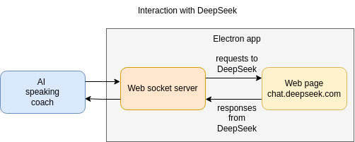

# Ai Speaking Coach using DeepSeek

AI speaking coach is designed to help practice conversational skills in a foreign language. This python-based program uses DeepSeek large language model. As of February 2025, DeepSeek does not provide a voice interface. To enable voice interaction with DeepSeek, the Whisper local neural network is used for speech recognition, and gTTS (Google Text-to-Speech) is used for speech synthesis.


The script records audio from the microphone in real time, converts the audio stream into text, and sends it to DeepSeek electron app using websockets. Then, upon receiving a response from DeepSeek, the program plays back the received text.

Since the DeepSeek API is paid, we use an approach that involves sending messages through their standard website, emulating the behaviour of a regular user.




## Installation

```bash
git clone https://github.com/ultrabytecoder/ai-english-trainer.git
cd ai-english-trainer.git

# Create a virtual environment
python -m venv venv

# Activate the virtual environment - Unix
source venv/bin/activate

# Install the requirements
pip install -r requirements.txt

cd deepseek-electron
npm install

```

## Usage

At first, DeepSeek electron client should be started. The user should log in to DeepSeek web site.
```bash

# Run deepseek-electron application
cd deepseek-electron
npm run start
```

Once the user is logged in, the main application script should be executed:

```bash
# Run english trainer script
python ai_english_trainer.py
```

### Start prompt

There are several starter prompt options for DeepSeek that might suit you, depending on your level of foreign language proficiency.

* The default one (English): "Can you ask me questions in English? I will reply in English. If I speak wrong, tell me about it and ask to repeat. Please speak in short phrases"

* Explanation what is wrong in the user's native language: "Can you ask me questions in English? I will reply in English. If I speak wrong, tell me about it in < here should be your language > and ask to repeat. Please speak in short phrases"

The starter prompt is configured in a file starter-prompt.txt. Of course, you can come up with options that are more suitable for you.


